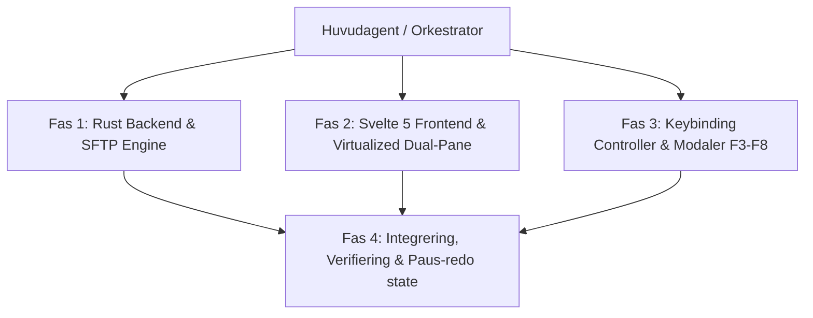

# 🚀 Genomförandeplan: RLCommander

> [!NOTE]
> **RLCommander** är en modern, högpresterande dual-pane filhanterare (Total Commander-klon) byggd med **Tauri v2**, **Rust**, **Svelte 5**, **TypeScript** och **Tailwind CSS**, komplett med inbyggd **SFTP-klient** och tangentbordsstöd (F3–F8).

---

## 📋 Översikt över Etapper & Agentfördelning

---

## 📌 Detaljerad Etappindelning

### 🔧 Fas 1: Rust Backend Engine (`src-tauri/`)
- [x] **Tauri v2 konfiguration**: `Cargo.toml`, `tauri.conf.json`, `build.rs`, `main.rs`, `lib.rs`
- [x] **Unified FileSystem Trait System** (`src-tauri/src/fs/`):
  - `traits.rs`: `FileSystemProvider` trait (`list_directory`, `create_dir`, `remove`, `exists`, `copy_file`, `move_file`, `read_preview`)
  - `local.rs`: Lokal filhantering för Linux (`/`) och Windows enheter (`C:\`)
  - `sftp.rs`: Native SFTP-anslutning via `ssh2`
- [x] **Tauri IPC Commands & Progress Stream**:
  - `commands.rs`: `list_files`, `connect_sftp`, `copy_file_async`, `delete_items`, `create_directory`
  - Asynkron filöverföringsmotor med Tokio `mpsc` channels och live `transfer-progress` events (MB/s, bytes, status)

---

### 🎨 Fas 2: Svelte 5 Dual-Pane Frontend (`src/`)
- [x] **Konfigurationsfiler & CSS**:
  - `package.json`, `vite.config.ts`, `tsconfig.json`, `tailwind.config.js`, `app.css` (Glassmorphic dark design system)
- [x] **State Management & Typer**:
  - `src/lib/types.ts`: Datastrukturer för `FileItem`, `PaneState`, `TransferProgress`, `SFTPConfig`
  - `src/lib/tauri.ts`: IPC-anrop till Rust backend
  - `src/lib/stores/commander.ts`: Tillståndshantering för vänster/höger panel, markeringar och fokus
- [x] **Paneler & Filtabell**:
  - `Pane.svelte`: Header med sökstig och enhetsväljare
  - `FileList.svelte`: Virtualiserad filvy med alla filattribut, ikoner och markeringsstöd
  - `Splitter.svelte`: Dragbar avdelare mellan paneler

---

### ⌨️ Fas 3: Tangentbordsstyrare & Modaler (`F3`–`F8`)
- [x] **Tangentbordsnavigering**:
  - `Tab`: Växla aktiv panel (Vänster ↔ Höger)
  - `ArrowUp` / `ArrowDown`: Flytta markör
  - `Space` / `Insert`: Markera/avmarkera fil
  - `Enter`: Öppna mapp/fil
  - `Backspace`: Navigera till föräldramapp (`..`)
- [x] **Funktionsknappars Modaler & Toolbar**:
  - `Toolbar.svelte`: Nedre verktygsrad (F3–F8)
  - `FileViewerModal.svelte` (`F3` Filvisare med textkopiering)
  - `CreateDirModal.svelte` (`F7` Skapa mapp)
  - `DeleteConfirmModal.svelte` (`F8` Ta bort bekräftelse)
  - `SftpModal.svelte`: SFTP Snabbanslutning (Värd, Port, Användare, Auth)
  - `ProgressDrawer`: Bakgrundsöverföring med hastighetsmätare i App.svelte

---

### 🏁 Fas 4: Integrering, Verifiering & Paushantering
- [x] Samla ihop alla moduler och verifiera med kodanalys och strukturkontroll.
- [x] Skapa ett rent repository-state i Git så att du när som何时 kan natt-pausa och återuppta i morgon utan förlust!
